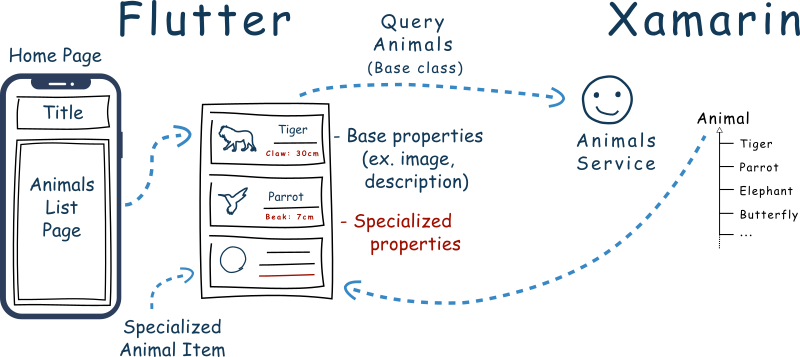
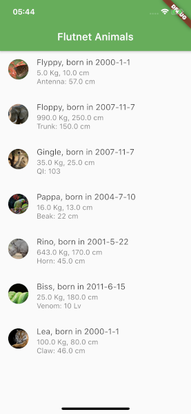
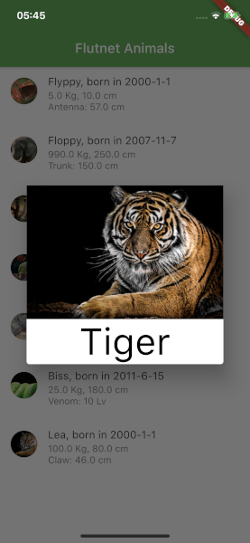

# Flutnet - Animals app

A simple app developed using [Flutnet](https://www.flutnet.com) that show a list of animals. The main part of this project is to show the new important feature of Flutnet, that now allow [PlatformData](https://www.flutnet.com/Documentation/Introduction/Platform-Services-Data-Events) object to support **inheritance**.

## [Polymorphism](https://en.wikipedia.org/wiki/Polymorphism_(computer_science))

With Flutnet **1.0.5**, the communication Channels now support **bidirectional polimorphism** allowing to retrieve for example a `List<Animal>` each one with a specific subtype of `Animal` (like `Tiger`, `Monkey`, `Snake` because they extends the base `Animal` class).

## Run the project for the first time

- With Xamarin installed, clone project and open the solution file **FlutnetAnimals.sln**
- Build the **FlutnetAnimals.ServiceLibrary**: this will update the **flutnet_animals_bridge** package project.
- With Flutter 1.22.6 installed, go to `Flutter/flutnet_animals` project and run 
    - `flutter build ios-framework --no-profile` (for Flutter iOS)
    - `flutter build aar --no-profile` (for Flutter Android)
- Before running **FlutnetAnimals.Android** _ensure to manually uninstall the previus deployed application_ `com.example.app` from your device (see [Flutnet Known Issues page](https://www.flutnet.com/Download/Release-Notes/Known-Issues)). This procedure must be done every time you make changes to the Flutter module and you want these changes to be reflected inside the Xamarin Android application
    - `adb uninstall --user 0 com.example.app`
- Run the Xamarin project from Visual Studio
- Remember that **FlutnetNotes.iOS** project works only on **macOS**. See [Flutnet on Windows vs macOS](https://www.flutnet.com/Documentation/Getting-Started/Flutnet-on-Windows-vs-macOS).

## Screenshots

