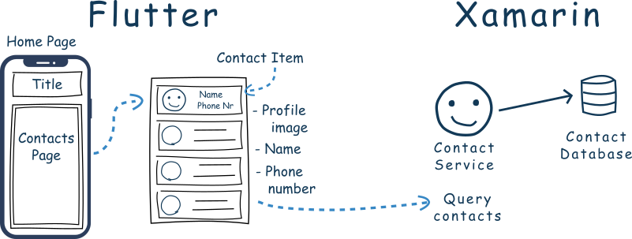

# Flutnet Contact List

A simple contact list developed using [Flutnet](https://www.flutnet.com). All the contacts informations are obtained from Xamarin using a specific **PlatformService**. See all the details reading [Flutnet Contact List Tutorial](https://www.flutnet.com/Documentation/Samples-Tutorials/Flutnet-Contact-List).

## Features
- Obtain a list of contacts using a specific Xamarin class called **ContactService**

## Flutter dependencies

- flutter_bloc: ^6.1.0
- equatable: ^1.2.5

## Run the project for the first time

- With Xamarin installed, clone project and open the solution file **FlutnetContactList.sln**
- Build the **FlutnetContactList.ServiceLibrary**: this will update the **flutnet_contact_list_bridge** package project.
- With Flutter 1.22.6 installed, go to `Flutter/flutnet_contact_list` project and run 
    - `flutter build ios-framework --no-profile` (for Flutter iOS)
    - `flutter build aar --no-profile` (for Flutter Android)
- Before running **FlutnetContactList.Android** _ensure to manually uninstall the previus deployed application_ `com.example.app` from your device (see [Flutnet Known Issues page](https://www.flutnet.com/Download/Release-Notes/Known-Issues)). This procedure must be done every time you make changes to the Flutter module and you want these changes to be reflected inside the Xamarin Android application
    - `adb uninstall --user 0 com.example.app`
- Run the Xamarin project from Visual Studio
- Remember that **FlutnetContactList.iOS** project works only on **macOS**. See [Flutnet on Windows vs macOS](https://www.flutnet.com/Documentation/Getting-Started/Flutnet-on-Windows-vs-macOS).

## Screenshots

