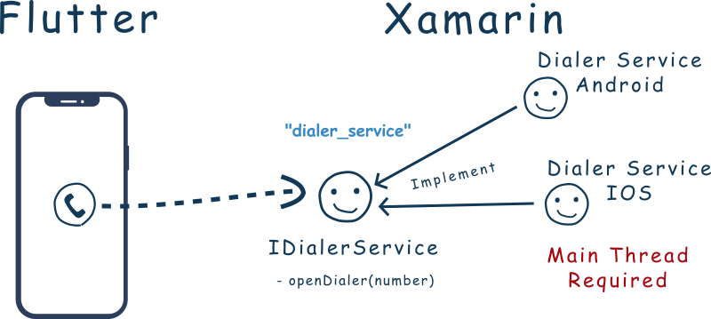

# Flutnet Dialer

A simple app that open system dialer developed using [Flutnet](https://www.flutnet.com). See all the details reading [Flutnet Dialer Tutorial](https://www.flutnet.com/Documentation/Samples-Tutorials/Flutnet-Dialer).

## Features

- All the UI realized in Flutter
- Flutter use a Xamarin Interface **IDialerService** in order to open the specific platform dialer
- Each **FlutnetDialer.Android** and **FlutnetDialer.iOS** projects implements their specific native services:
    - **DialerServiceIOS.cs**
    - **DialerServiceDroid.cs**

## Run the project for the first time

- With Xamarin installed, clone project and open the solution file **FlutnetDialer.sln**
- Build the **FlutnetDialer.ServiceLibrary**: this will update the **flutnet_dialer_bridge** package project.
- With Flutter 1.22.6 installed, go to `Flutter/flutnet_dialer` project and run 
    - `flutter build ios-framework --no-profile` (for Flutter iOS)
    - `flutter build aar --no-profile` (for Flutter Android)
- Before running **FlutnetDialer.Android** _ensure to manually uninstall the previus deployed application_ `com.example.app` from your device (see [Flutnet Known Issues page](https://www.flutnet.com/Download/Release-Notes/Known-Issues)). This procedure must be done every time you make changes to the Flutter module and you want these changes to be reflected inside the Xamarin Android application
    - `adb uninstall --user 0 com.example.app`
- Run the Xamarin project from Visual Studio
- Remember that **FlutnetDialer.iOS** project works only on **macOS**. See [Flutnet on Windows vs macOS](https://www.flutnet.com/Documentation/Getting-Started/Flutnet-on-Windows-vs-macOS).

## Screenshots

