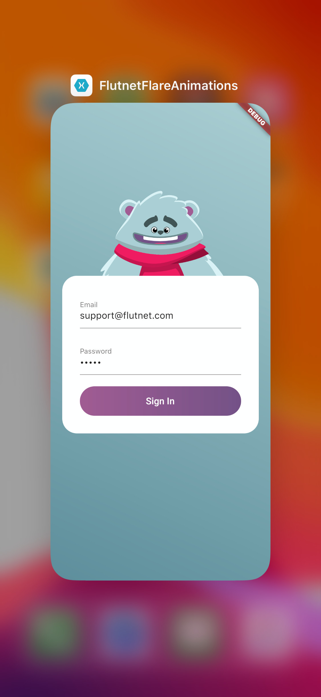

# Flutnet Flare - Xamarin + Flutter + Flare

An elegant login page developed using [Flutnet](https://www.flutnet.com). The Flutter UI was integrated using [Rive](https://rive.app/). 
The Login page was imported from the project [teddy](https://github.com/2d-inc/Flare-Flutter/tree/master/example/teddy). In this example we show how to integrate Flare animations inside your Xamarin app thanks to Flutter as UI Layer.

## Dependencies

- flare_flutter: ^2.0.6
- flare_dart: ^2.3.4

## Run the project

- With Xamarin installed, clone project and open the solution file **FlutnetFlare.sln**
- Build the **FlutnetFlare.ServiceLibrary**: this will update the **flutnet_flare_bridge** package project.
- With Flutter 1.20.2 installed, go to `Flutter/flutnet_flare` project and run `flutter build ios-framewok --no-profile` and `flutter build aar --no-profile`
- Run the Xamarin project from Visual Studio
- Remember that **FlutnetFlare.iOS** project works only on **macOS**. See [Flutnet on Windows vs macOS](https://www.flutnet.com/Documentation/Getting-Started/Flutnet-on-Windows-vs-macOS).

## Screenshots

