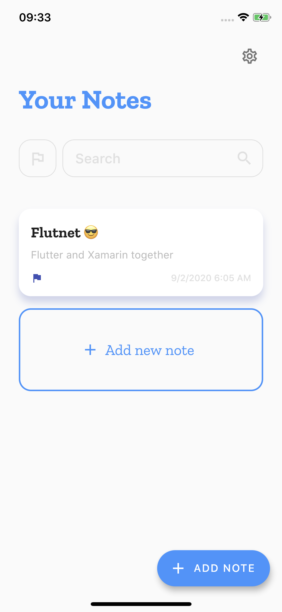

# Flutnet - Notes app

An elegant notes taking app developed using [Flutnet](https://www.flutnet.com). The Flutter UI was imported from the project [flutter-notes-app](https://github.com/roshanrahman/flutter-notes-app). All the Flutter native plugins like **sqflite** were replaced using Xamarin .NET Libraries like **SQLite-Pcl**. 

## Features

1. *Animated UI*: A beautiful, minimalist user interface with subtle animations.
2. *Dark mode*: Light and dark theme variants.
3. *Mark notes as important*: Mark notes as important and filter them.
4. *Search*: Search your notes.
5. *Edit note*: Edit note that you saved previously

## Dependencies

- outline_material_icons: ^0.1.0
- intl: ^0.15.8

## Replaced Flutter dependencies using Xamarin

- url_launcher: ^5.0.3 --> [Xamarin.Essentials](https://www.nuget.org/packages/Xamarin.Essentials/)
- shared_preferences: ^0.5.3+1 --> [Xamarin.Essentials](https://www.nuget.org/packages/Xamarin.Essentials/)
- share: ^0.6.1+1 --> [Xamarin.Essentials](https://www.nuget.org/packages/Xamarin.Essentials/)
- sqflite: ^1.1.5 --> [sqlite-net-pcl](https://www.nuget.org/packages/sqlite-net-pcl/)

## Run the project for the first time

- With Xamarin installed, clone project and open the solution file **FlutnetNotes.sln**
- Build the **FlutnetNotes.ServiceLibrary**: this will update the **flutnet_notes_bridge** package project.
- With Flutter 1.20.2 installed, go to `Flutter/flutnet_notes` project and run 
    - `flutter build ios-framework --no-profile` (for Flutter iOS)
    - `flutter build aar --no-profile` (for Flutter Android)
- Before running **FlutnetNotes.Android** _ensure to manually uninstall the previus deployed application_ `com.example.app` from your device (see [Flutnet Known Issues page](https://www.flutnet.com/Download/Release-Notes/Known-Issues)). This procedure must be done every time you make changes to the Flutter module and you want these changes to be reflected inside the Xamarin Android application
    - `adb uninstall --user 0 com.example.app`
- Run the Xamarin project from Visual Studio
- Remember that **FlutnetNotes.iOS** project works only on **macOS**. See [Flutnet on Windows vs macOS](https://www.flutnet.com/Documentation/Getting-Started/Flutnet-on-Windows-vs-macOS).

## Screenshots

