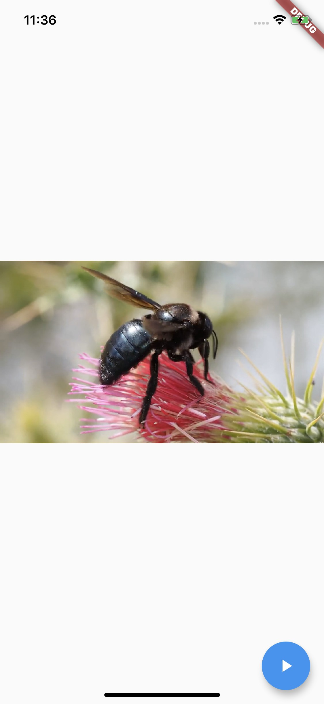

# Flutnet Video Player Plugin

Using [Flutnet](https://www.flutnet.com) you can integrate the most used flutter plugins in your xamarin app. In this example we have integrated the [video_player](https://pub.dev/packages/video_player). See all the details reading [Flutnet Video Player Tutorial](https://www.flutnet.com/Documentation/Samples-Tutorials/Flutnet-Video-Player-Plugin).

## Features

- The Flutter UI module use the [video_player](https://pub.dev/packages/video_player) plugin to show  a video about a bee using the URL https://flutter.github.io/assets-for-api-docs/assets/videos/bee.mp4 

<video  src="https://flutter.github.io/assets-for-api-docs/assets/videos/bee.mp4" controls width=450 >
  Your browser does not support the video tag.
</video>

## Run the project for the first time

- With Xamarin installed, clone project and open the solution file **FlutnetVideoPlayer.sln**
- Build the **FlutnetVideoPlayer.ServiceLibrary**: this will update the **flutnet_video_player_bridge** package project.
- With Flutter 1.22.5 installed, go to `Flutter/flutnet_video_player` project and run 
  - `flutter build ios-framework --no-profile` (for Flutter iOS)
  - `flutter build aar --no-profile` (for Flutter Android)
- Before running **FlutnetVideoPlayer.Android** _ensure to manually uninstall the previus deployed application_ `com.example.app` from your device (see [Flutnet Known Issues page](https://www.flutnet.com/Download/Release-Notes/Known-Issues)). This procedure must be done every time you make changes to the Flutter module and you want these changes to be reflected inside the Xamarin Android application
    - `adb uninstall --user 0 com.example.app`
- Run the Xamarin project from Visual Studio
- Remember that **FlutnetVideoPlayer.iOS** project works only on **macOS**. See [Flutnet on Windows vs macOS](https://www.flutnet.com/Documentation/Getting-Started/Flutnet-on-Windows-vs-macOS).

## Screenshots

