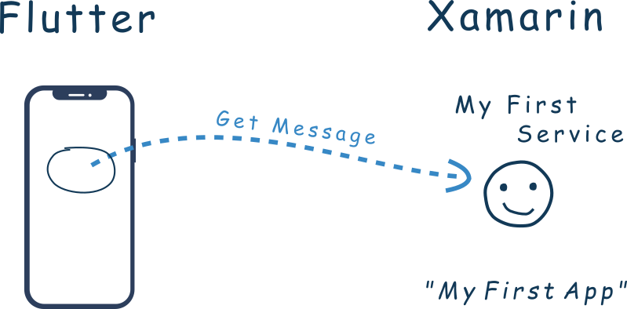
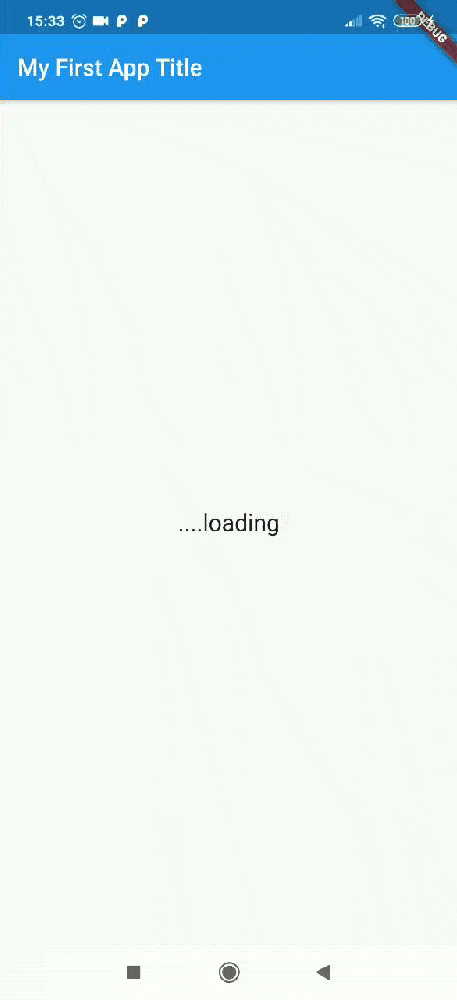

# Flutnet My First App

A simple app developed using [Flutnet](https://www.flutnet.com). See all the details reading [Write your first Flutnet App](https://www.flutnet.com/Documentation/Getting-Started/Write-your-first-Flutnet-App).

## Features

- All the UI realized in Flutter
- The flutter code get a string message value using a Xamarin class called **MyFirstService**.

## Run the project for the first time

- With Xamarin installed, clone project and open the solution file **MyFirstApp.sln**
- Build the **MyFirstApp.ServiceLibrary**: this will update the **my_first_app_bridge** package project.
- With Flutter 1.20.2 installed, go to `Flutter/my_first_app` project and run 
    - `flutter build ios-framework --no-profile` (for Flutter iOS)
    - `flutter build aar --no-profile` (for Flutter Android)
- Before running **MyFirstApp.Android** _ensure to manually uninstall the previus deployed application_ `com.example.app` from your device (see [Flutnet Known Issues page](https://www.flutnet.com/Download/Release-Notes/Known-Issues)). This procedure must be done every time you make changes to the Flutter module and you want these changes to be reflected inside the Xamarin Android application
    - `adb uninstall --user 0 com.example.app`
- Run the Xamarin project from Visual Studio
- Remember that **MyFirstApp.iOS** project works only on **macOS**. See [Flutnet on Windows vs macOS](https://www.flutnet.com/Documentation/Getting-Started/Flutnet-on-Windows-vs-macOS).

## Screenshots

